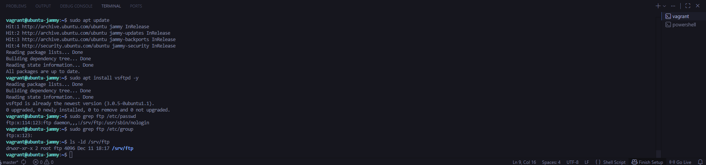
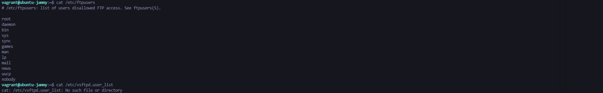
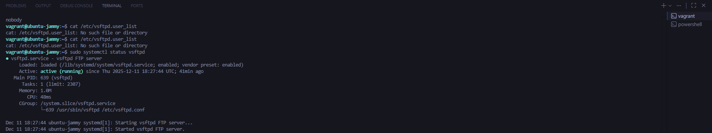
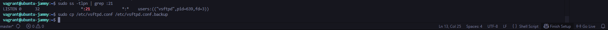
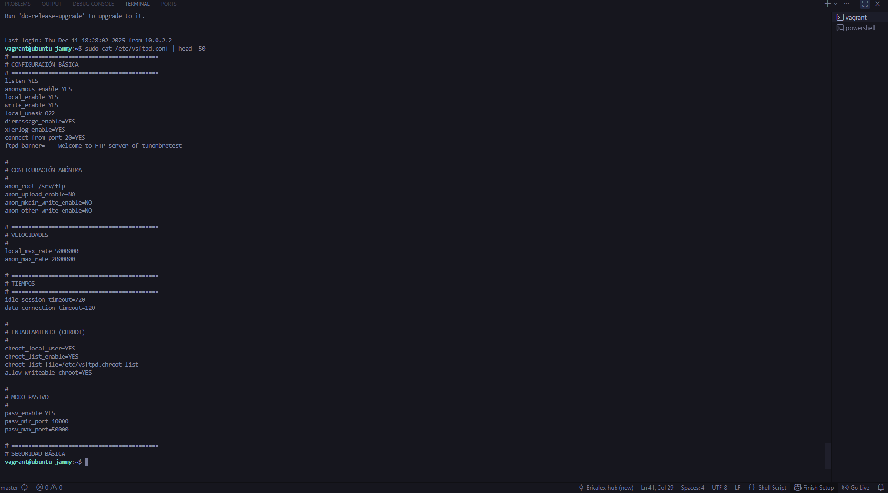
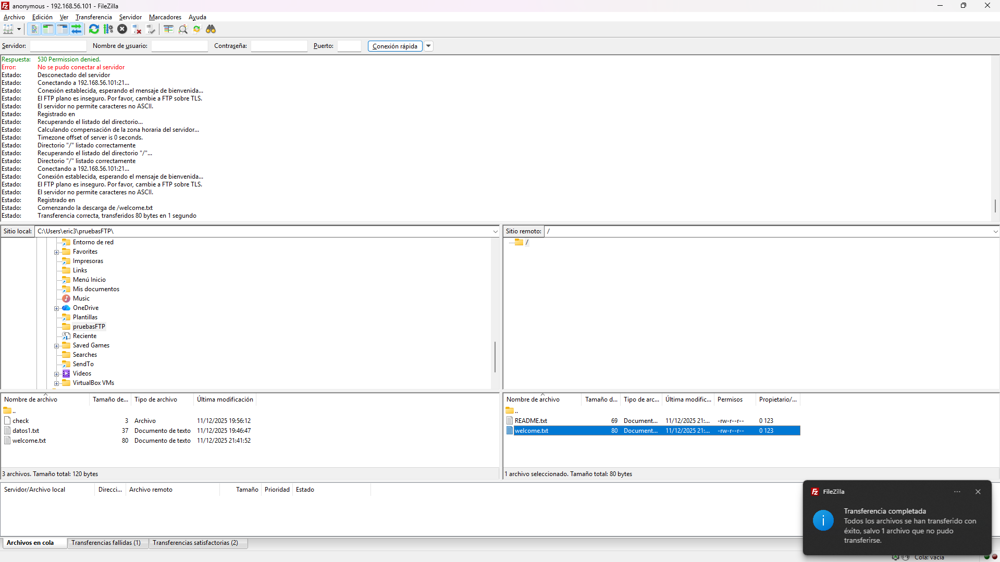
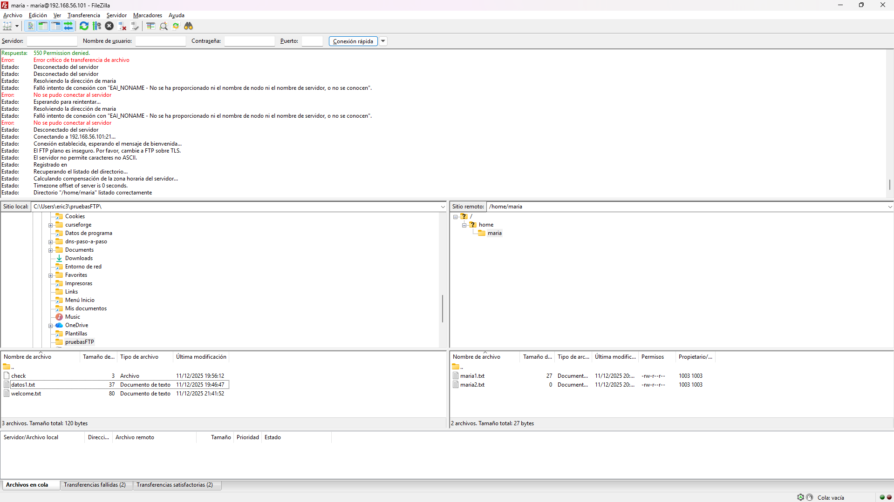
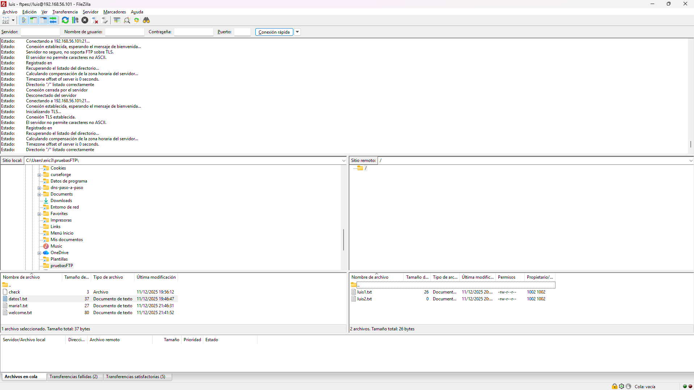
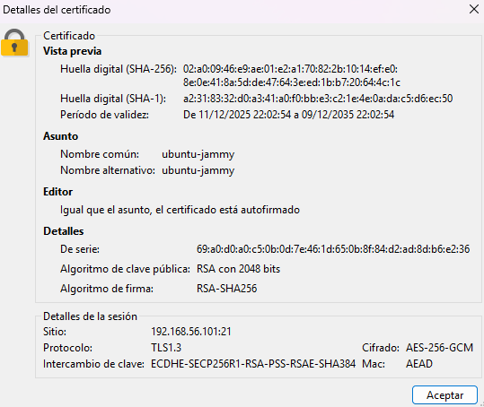

# Práctica: FTP

## 1. Objetivo

Antes de poder iniciar con esta práctica, hice un servidor dns ya que me hacía falta para pdoer avanzar en FTP asi que monté un servidor DNS básico con Bind9 en Debian para usarlo como soporte. Configuré Bind para que escuchara solo por IPv4 en la IP de mi servidor, definí una zona directa e inversa para mi dominio (con sus registros SOA, NS, A y PTR) y limité la recursión a mi red local. Después validé las zonas, reinicié el servicio y probé desde un cliente que tanto la resolución de nombre a IP como la inversa funcionaban correctamente.

# 2. Uso del cliente FTP gráfico (FileZilla)

### 1. Instalación del Servidor FTP (vsftpd)
- Instalación del paquete `vsftpd`.
- Verificación del usuario `ftp` y su directorio `/srv/ftp`.
- Creación de usuarios locales: `luis`, `maria`, `miguel`.
- Creación de archivos de prueba en los homes de los usuarios.

#### 1.1 Instalación de vsftpd y directorio por defecto

#### 1.2 Comprobación de usuarios restringidos y estado del servicio

### 2. Configuración de vsftpd
Modificación del archivo `/etc/vsftpd.conf` para cumplir los requisitos:

- **Modo standalone** (escucha en IPv4).
- **Mensaje de bienvenida** personalizado.
- **Límites de velocidad:** 5 MB/s para usuarios locales, 2 MB/s para anónimos.
- **Acceso anónimo:** solo lectura.
- **Acceso local:** lectura y escritura.
- **Enjaulamiento (chroot):** todos los usuarios excepto `maria`.
- **Tiempo de inactividad:** 720 segundos.

### 5. Pruebas de Conexión FTP

#### 3.1. Conexión Anónima
- Conexión exitosa al servidor.
- Descarga de archivos permitida.
- Subida de archivos denegada (como se esperaba).

#### 3.2. Usuario `maria` (NO enjaulado)
- Conexión autenticada correcta.
- Puede navegar fuera de su directorio home.
- Verificación de que no está enjaulada.

#### 3.3. Usuario `luis` (SI enjaulado)
- Conexión autenticada correcta.
- No puede salir de su directorio home.
- Verificación del enjaulamiento.

### 4. Pruebas de FTPS
- Conexión segura con el usuario `luis` usando FileZilla (FTPES).
- Aceptación del certificado del servidor.
- Verificación del candado de conexión segura.
- Conexión FTPS anónima denegada (como se configuró).

#### 4.1 Conexión FTPS de `luis` (FTPES)

#### 4.2 Certificado SSL del servidor

