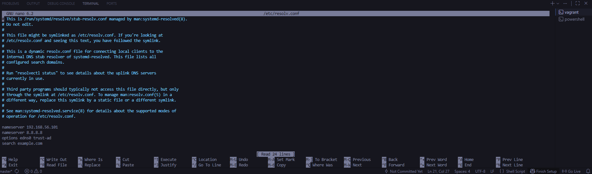
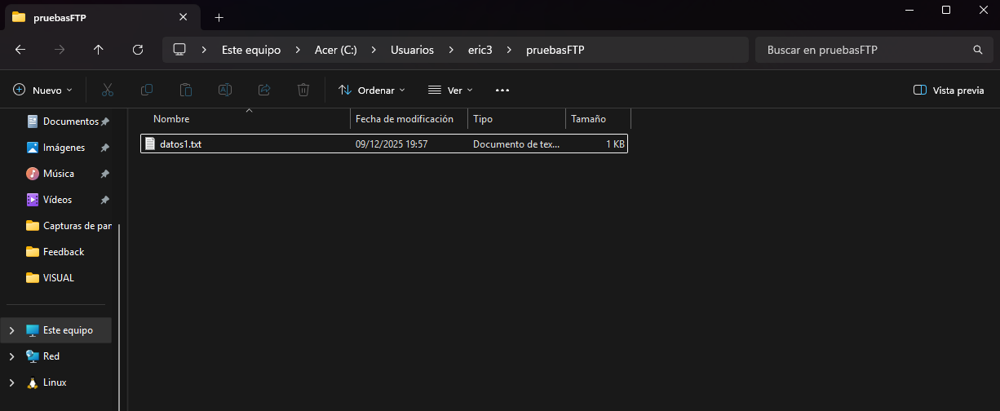
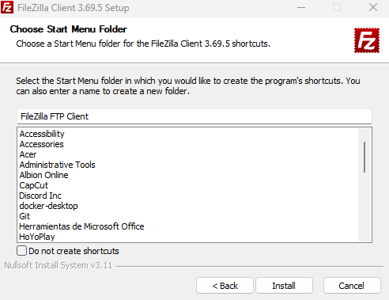
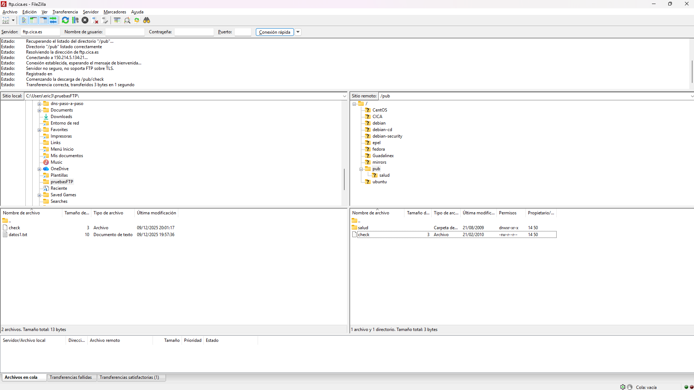
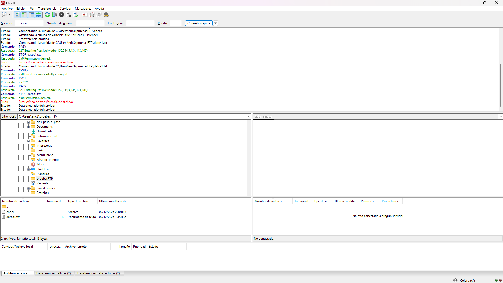
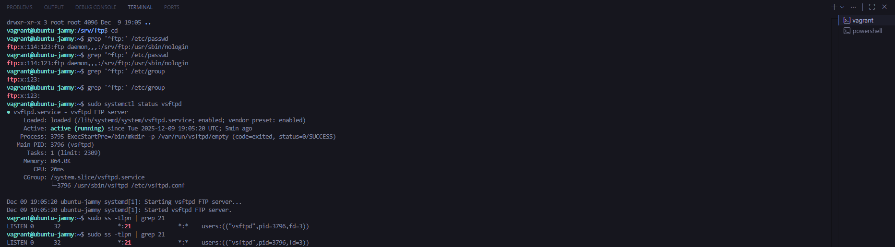
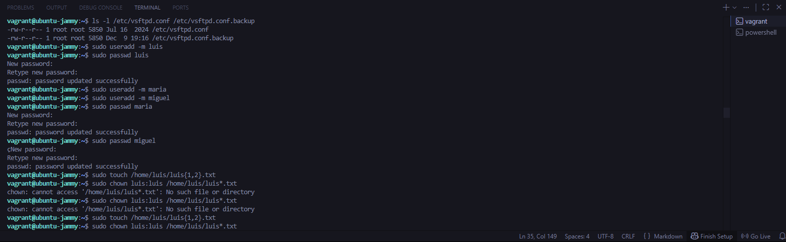
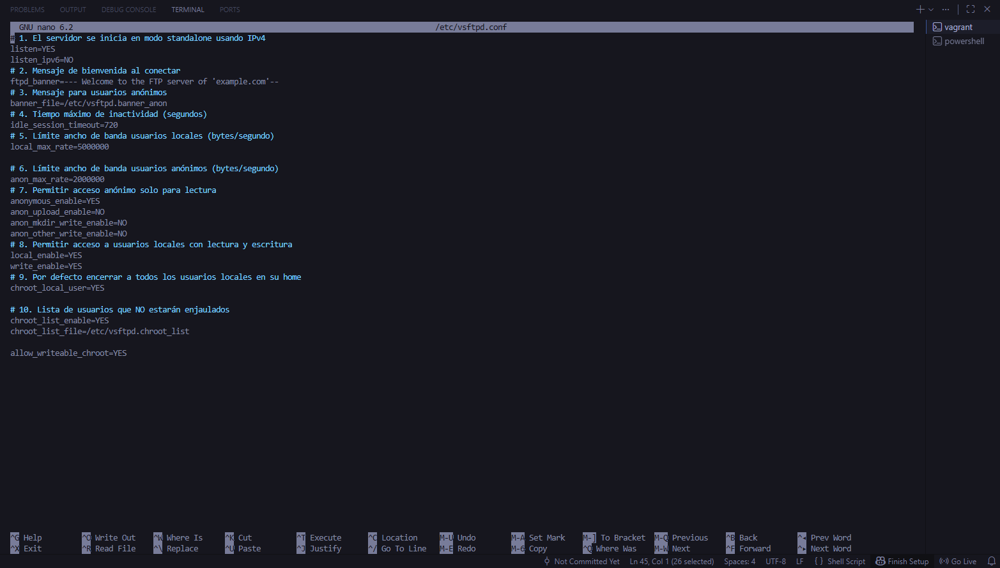
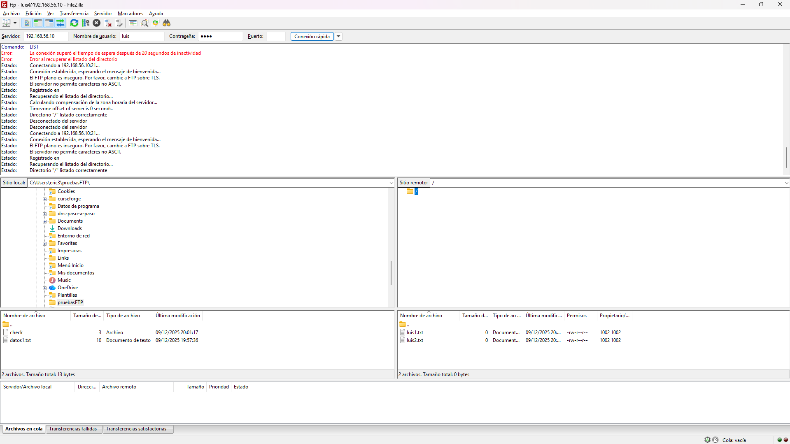
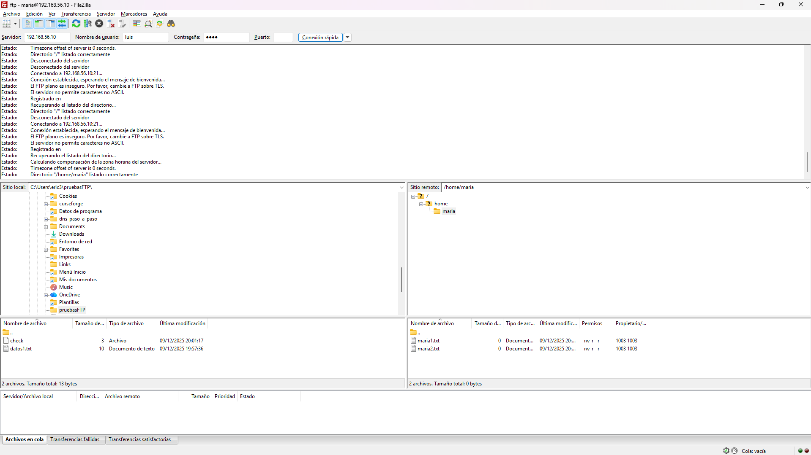

# Práctica: FTP

## 1. Objetivo

Antes de poder iniciar con esta práctica, hice un servidor dns ya que me hacía falta para pdoer avanzar en FTP asi que monté un servidor DNS básico con Bind9 en Debian para usarlo como soporte. Configuré Bind para que escuchara solo por IPv4 en la IP de mi servidor, definí una zona directa e inversa para mi dominio (con sus registros SOA, NS, A y PTR) y limité la recursión a mi red local. Después validé las zonas, reinicié el servicio y probé desde un cliente que tanto la resolución de nombre a IP como la inversa funcionaban correctamente.

# 2. Uso del cliente FTP gráfico (FileZilla)

En esta práctica he instalado y configurado un servidor FTP con vsftpd en una máquina Ubuntu. Primero modifique el archivo pedido:

Luego cree el directorio pruebasftp y dentro puse datos1.txt. Acontinuación intales Filezilla y me conecte a ftp.can.ci para descargar el ficher check y despues intentar subir a ese servidor

Creaciónd de directorio:

Instalación Filezilla:

Descargar check en directorio:

Transferir datos1.txt:

Segundo instalé el paquete `vsftpd` y comprobé que se creaba el usuario `ftp` con directorio `/srv/ftp`, revisando los archivos `/etc/passwd` y `/etc/group`. También verifiqué la existencia del directorio `/srv/ftp`, sus permisos, los usuarios vetados en los ficheros de configuración y que el servicio estuviera activo y escuchando en el puerto 21/TCP usando `systemctl` y `ss`.

Comprobación de usuarios y grupos de ftp parte 1:

Comprobación de usuarios y grupos de ftp parte 2:

Después creé los usuarios locales `luis`, `maria` y `miguel` con `useradd` y `passwd`, y generé ficheros de prueba en los homes de `luis` y `maria`.

En `/etc/vsftpd.conf` configuré el servidor para funcionar en modo standalone IPv4, mostrar un mensaje de bienvenida personalizado, permitir acceso anónimo solo de lectura y permitir a los usuarios locales subir y descargar archivos. Además activé el chroot para que todos los usuarios locales quedaran enjaulados en su directorio home excepto `maria`, usando `chroot_local_user=YES` y `chroot_list_file` con `maria` dentro.

A continuación probé el servidor desde FileZilla conectando por FTP plano a la IP de la máquina virtual con los usuarios `luis` y `maria`. Comprobé en las capturas que `luis` quedaba enjaulado en su directorio (solo veía sus archivos) mientras que `maria` podía navegar fuera de su home, cumpliendo los requisitos de la práctica. También ajusté opciones como `allow_writeable_chroot=YES` y el modo activo en FileZilla para resolver errores típicos de chroot y del listado de directorios.

Conexion mediante Luis:

Conexion mediante María:

Finalmente intenté convertir el servidor en un FTP seguro (FTPS) creando un certificado autofirmado en `/etc/ssl/certs/example.com.pem` y añadiendo directivas SSL en `vsftpd.conf` (`ssl_enable`, `rsa_cert_file`, `force_local_logins_ssl`, etc.). Sin embargo, alguna de estas opciones provocaba que el servicio vsftpd fallara al arrancar con el error `status=2/INVALIDARGUMENT`, por lo que documenté el intento y dejé el servidor funcionando correctamente sin cifrado, priorizando que el servicio básico FTP estuviera operativo y comprobado desde el cliente.
